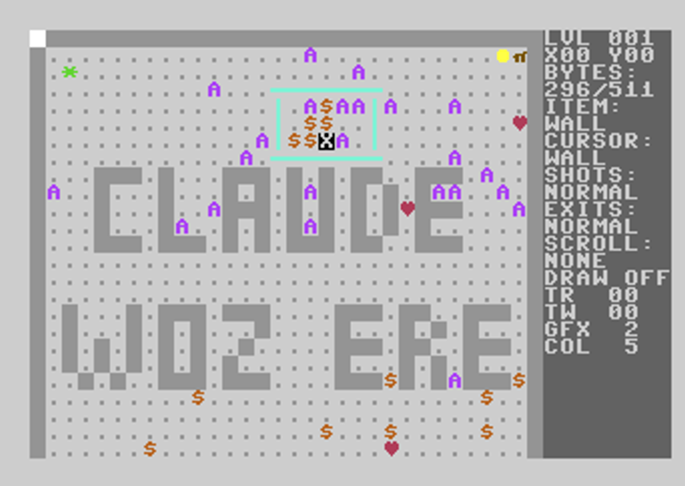

# Gauntlet Construction Kit and level generator



Two things, in two places.

**The level editor runs on the Commodore 64.** It is 6502 machine code —
`gauntkit.prg`, about 8K — that you load and run on the machine (or an
emulator) alongside your level disk, and it edits the levels in place. It
would have gone down rather better in 1987, when there were people who
wanted one. Better late than never.

**The level generator runs on your computer.** It is Python, and it writes
whole 128-level `.d64` disks (and cassette images) that the C64 then plays.
Nothing of it goes near the C64 — it produces the disk, and the C64 reads
it.

With that, *Gauntlet* takes its place alongside every other C64 game with
a construction kit, and Gamebase64 can look forward to its share of levels
consisting of one room, four hundred Deaths and an exit nobody can reach.
First Star opened this door with the *Boulder Dash Construction Kit* in
1986 and it has never been shut since. The generator in this repository is
merely the first tool that can produce such levels at scale, unattended,
overnight.

The 128 levels on the finished `gauntlet_levels.d64` were generated rather
than designed, which makes them, in the tradition of *Gauntlet: The Deeper
Dungeons*, something more like **Gauntlet: The Sloppier Dungeons**.

A couple of dozen are set pieces that were designed — the two Deaths
levels, the vault, the hoard, the ones built out of doors, the ones that
spell something. And the placement rules do carry some thinking: a
teleporter is meant to land you somewhere a key would otherwise be spent,
a lobber is meant to sit behind a wall it can throw over, generators sit
deep rather than by the door, keys sit off the route so fetching one is a
detour.

The rest is arithmetic. The set matches the arcade original on twenty
counts and passes every playability check, but matching a distribution is
not the same as designing a level, and most of these nobody sat down and
thought about. Where a level is good it is usually because a rule happened
to fire well, not because anyone meant it.

Swap the finished `.d64` in at the game's press-fire prompt: the game only
reads `LEVEL nnn` once it is running, so it takes its levels from there.

Use a **Deeper Dungeons** disk. It carries bug fixes the original release
lacks, and in 2026 it is the easiest version to find. An original
*Gauntlet* disk works too, provided it holds its levels as separate
`LEVEL nnn` files. See *Which game disk to use* below.

## Build a disk

    python3 makedisk.py                 # gauntlet_levels.d64, seed 0
    python3 makedisk.py --seed 12       # a different 128 levels

    python3 genlevels.py --difficulty brutal --out set7
    python3 mklevdisk.py --levels set7 --out brutal.d64
    python3 makedisk.py --out mine.d64 --keep mylevels

All Python, running on your computer rather than the C64. Python 3 and
nothing else; five files have to sit together:

| file | what it is |
|------|-----------|
| `makedisk.py` | runs the two steps below |
| `genlevels.py` | the level generator |
| `gauntlet_dd.py` | the level format codec |
| `mklevdisk.py` | the `.d64` writer |
| `gauntkit.prg` | the editor, already assembled |

The steps also run separately, so a set can be inspected or hand-edited in
between:

    python3 genlevels.py --seed 7 --out set7
    python3 mklevdisk.py --levels set7 --kit gauntkit.prg --out disk.d64

## A little history

*Gauntlet: The Deeper Dungeons* was released in 1987 by U.S. Gold in the
UK and Europe, and by Mindscape in the United States, for the home
computer ports of *Gauntlet* — Commodore 64, ZX Spectrum, Amstrad CPC, MSX,
Atari ST. Gremlin Graphics developed it.

It is usually described as needing the original game to run, and on some
formats it did. **The C64 disk does not.** It is a complete, standalone
game: the same sixteen program files as the original — fourteen of them
byte-identical, `GAUNTPROG` differing by fourteen bytes, plus a loader of
its own — and then 128 level files in place of the originals. You boot it
and play. Reviews of the day called it an expansion pack and priced it as
one, but what U.S. Gold actually pressed was the whole game with new
dungeons on it.

They could have shipped it the other way. The game only reads `LEVEL nnn`
once it is already running, so a disk holding nothing but level files can
be swapped in at the prompt and works perfectly well — that is exactly
what this project does, and it is what makes the expansion-pack framing
technically sound even though the C64 release was not built that way.
Pressing the whole game was a commercial choice, not a technical one: no
disk-swapping at the counter, and it could be sold to somebody who had
never owned *Gauntlet*.

Many of its levels came from **a competition run across Europe**. The
original game's instructions invited players to send in dungeons of their
own; ten winners each received a Gauntlet T-shirt and a copy of the
finished program. So it was player-made content, pressed onto a boxed
product and sold, thirty years before anyone called it that.

How the entrants drew their dungeons is not something this project knows.
There was no level editor on the C64 release — the disk holds the game and
its levels and nothing else — so whatever they sent in, they sent on
paper, or on something U.S. Gold never shipped.

One claim made for it does not survive a look at the disk. **"512 new
levels"** is what every review repeated; the disk holds 128. The original
held 128 too, and the number may come from the game mirroring and flipping
its levels at runtime (`GAME-NOTES.md`, *The runtime mirror*), which turns
128 maps into 512 arrangements — every one of which the original could do
as well.

The other claim holds up. Reviewers agreed the levels were **much harder**,
and measured against the original's 128 they are:

| per level | original | Deeper Dungeons |
|-----------|----------|-----------------|
| Deaths | 2.0 | 5.4 |
| levels with a Death | 58 | 108 |
| traps | 0.8 | 1.8 |
| traps in levels 1-8 | 3 | 15 |
| teleporters | 1.2 | 2.4 |
| monsters | 33.9 | 38.9 |
| generators | 29.7 | 34.0 |

Nearly three times the Deaths, on almost every level. Twice the traps, and
five times as many in the opening levels — *Your Sinclair*'s "blue flashing
traps appear right from the beginning" is exactly right. It is also more
generous, with half again the food and two and a half times the magic,
which is what lets a player survive it. The program itself is the
original's apart from fourteen bytes (`GAME-NOTES.md`, *Two builds*); all
of the difference is in the level data.

The reviews were lukewarm — "more of the same, quite a lot more in fact",
in *Page 6*'s words — and the consensus was that it was not as good as the
original or the newly arrived arcade *Gauntlet II*. But it was cheap, and
*Gauntlet* players bought it anyway.

Now everyone gets to make their own *Gauntlet* levels. Sorry — no free
T-shirts.

## Which game disk to use

**A Deeper Dungeons disk is strongly recommended.** Not for its levels -
this replaces those - but because its `GAUNTPROG` carries bug fixes the
original release does not, and the original is prone to crashing.

**An original Gauntlet disk will also work**, so long as it holds its levels
as separate `LEVEL nnn` files. You get the same editing and the same
generated set; you also get the crashes.

The fix is small and specific: Deeper Dungeons clears four bytes of
per-monster state at the start of every level that the earlier build leaves
holding whatever the previous level put there. The routine that reads them
abandons its work when it finds a non-zero value, so the leak silently
disables that processing until something else resets it. Every other file
on the two disks is byte-identical, so that one change is the whole
difference between the builds. `GAME-NOTES.md` has the addresses.

**Some Gauntlet releases will not work with this at all.** There are disk
versions that store the levels in batches rather than as 128 separate
`LEVEL nnn` files. The editor loads and saves one named level file at a
time, so it cannot read those, and a disk built here will not feed them.

The test is quick: `LOAD"$",8` on your game disk. If it shows a long list
of `LEVEL 001` .. `LEVEL 128` entries, you are fine. If instead it shows a
short list with single-letter files of about 21 blocks each - `A`, `B`, `C`
and so on - it is a batched release and none of this applies.

One such disk examined here holds its levels in fifteen files named `A` to
`O`, all loading at `$2000`: `A` carries seven levels and the rest ten
apiece, each in a fixed 512-byte slot, 147 slots for a 128-level set. The
records inside those slots are the same format this project documents -
many match a separate-files disk byte for byte - so the levels are
readable, but the packing, the ordering and the loader are all different.

Those levels came from the **cassette**: all fifteen files are
byte-identical to blocks on side 2 of the Gauntlet tape, down to the odd
seven-level first file matching the tape's short first block. Whether the
disk was an official release mastered from the tape or a conversion by
someone else is not settled - the disk examined was cracked, but its title
screen had been properly rewritten for disk, which either would do.
`GAME-NOTES.md` has the evidence.

Fixed-size slots are what tape needs, since a tape cannot seek to a named
file. Every level sits on side 2 in blocks of ten slots, and those blocks
are what the batched disk stores as files.

## The editor

This is the C64 half: `gauntkit.prg` loads with `LOAD"*",8` and runs with
`RUN` on the machine itself. It is pure 6502 machine code behind a one-line
BASIC stub, and edits any level file on a Gauntlet or Deeper Dungeons disk
that stores them as separate `LEVEL nnn` files. Press `?` for the key list.

Two keys reach settings the kit could not touch before. **`E`** turns
*one exit only* on and off — the game then keeps one exit tile and erases
the rest, picked afresh each play. **`W`** steps the scroll limits through
`NONE`, `HORIZ`, `VERT` and `BOTH`: they are two adjacent bits, so they
read better as one setting with four states than as two switches. The
panel spells both out — `EXITS: NORMAL` or `RANDOM`, `SCROLL: HORIZ` and
so on — rather than abbreviating them to letters. Both editors offer the
same settings, so a level can be given them on either machine.

The panel shows the byte cost of the level as you work: the format allows
511 bytes and a level that will not fit cannot be saved, so the count
matters. It warns about a missing start or exit, but never refuses a level
- you are free to build something unplayable if you want to, and history
suggests you will.

The palette holds everything the format can express and is worth placing,
including the six stat potions. One code is left out on purpose: `$32`
draws as a string of keys but behaves as a wall - an abandoned feature, and
placing it could only mislead a player. `object-codes.md` explains.

The generator never places a stat potion, because the game drops its own at
random from level 8 on, but putting one somewhere deliberately is a better
use of them than any roll.

## The batched layout, for the curious

Not a supported path. A Deeper Dungeons disk is the way to play this, and
the editor works only with separate `LEVEL nnn` files. `mkbatched.py` is
here because the layout turned out to be worth documenting, not because
anyone needs it.

It writes a level set in the cassette's arrangement:

    python3 mkbatched.py gauntlet_levels.d64 --out blocks

That gives fifteen files `A` to `O`, each with a `$2000` load address,
which can be put on a disk with `c1541` or any other tool. The layout was
recovered from a Gauntlet cassette: seven levels in the first block, then
eight progression levels and two treasure rooms in each of the rest, every
slot a fixed 512 bytes. Rebuilding the original disk's blocks this way
reproduces them exactly apart from the padding, where the original leaves
whatever was in the buffer and this writes zeros - the game reads only each
record's declared length, so that makes no difference.

**Untested on hardware.** Nothing here has been run against a batched
release; the layout is right but the loader may want more than the blocks.

### Writing tapes

    python3 mktap.py gauntlet_levels.d64

Masters a level set to a `.tap` in the game's turbo format, to replace side
2 of a Gauntlet cassette. About four and a half minutes of tape.

Give it a `.d64` or a directory of `LEVEL_nnn.prg` files and it works out
which it has, naming the output after the input. Editing a level disk with
the kit and then mastering that disk to tape is the expected route.

`--d64` and `--levels` say which it is outright, for scripts, or when a
directory happens to be named something ending in `.d64`:

    python3 mktap.py --d64 mydisk.d64 --out side2.tap
    python3 mktap.py --levels mylevels --out side2.tap

The format was recovered from the loader itself and is documented in
`GAME-NOTES.md`. `turbotape.py` reads and writes it, so it also decodes the
original tapes:

    python3 turbotape.py Gauntlet_Side_2.tap

**Untested on hardware.** All 128 levels survive a round trip through the
encoder, every checksum verifies, and re-encoding an original block
reproduces its pulses exactly - but nothing here has been played from a
real cassette, and side 1 would still have to come from the original.

## Check a set

`audit.py` measures a whole set against the arcade original across every
feature at once, which is the only way to notice that a change fixing the
doors has quietly halved the generators:

    python3 audit.py levels

It prints twenty measures with the arcade beside them and flags anything
more than 25% off. The arcade's own levels are not in this repository —
they are the original game's — so `--ref` has to point at a directory of
`LEVEL_nnn.prg` files taken from your own arcade Gauntlet disk; without it
the arcade column shows `-`. Tuning one number at a time is how a set ends up right
in the place you last looked and wrong everywhere else.


`verify.py` puts every level through the editor's own 6502 code — proving
it survives a load and a save — and applies the design rules:

    python3 verify.py set7

It uses `gcore.prg` and `symbols.json` (the assembled editor and its symbol
table) with the simulator in `tools/`.

## Editing on a PC

`gauntkit-pc.py` is the same editor for a desktop, in Python:

    python3 gauntkit-pc.py gauntlet_levels.d64
    python3 gauntkit-pc.py levels/

It shows the **whole 32 by 32 map at once**, which the C64 kit cannot —
that one scrolls a 16 by 10 window. Every cell prints a character as well
as a colour, because thirty-seven shades of block are not a map:

```
#   A           #   #      ####G      #  wall        $  treasure
#ck             #$G ###      #        |= door        k  key
#        @      #$  #####      #      @  start       X  exit
#               #   ##### # ###G      g  ghost       G  grunt
#GG         fG###   #G#  #  #  #      D  demon       L  lobber
#$#  G G    GGG$#   ##    X#          S  sorcerer    +  Death
#$#    m  GGGGGG|   #G ####  #        T  trap        !  trap-wall
```

A generator prints its family's letter on a dark square and a live monster
the same letter on a light one, so the two read apart without needing two
alphabets.

Not everything about a level is in the map. The **level settings** panel
holds what the C64 kit shows as GFX, COL and SHOTS — click any of them to
step it:

| setting | what it does |
|---------|--------------|
| wall graphic | which of eight tile sets the walls are drawn from |
| wall colour | which of eight colours they use |
| shots | normal, hurt, stun, or both — the game applies the two independently |
| one exit only | keep one exit at random and erase the others |
| scroll limits | `none`, `horiz`, `vert` or `both` |

These live in the two flag bytes of the header rather than the map, which
is why changing them never alters a single cell.

These last two are **new to the C64 construction kit** as well, which shows GFX,
COL and SHOTS and leaves the rest alone (its `TR` and `TW` lines are trap
and trap-wall counts, not settings). They are real level features — the
arcade sets *one exit only* on 33 of its levels — so the PC editor offers
them. A level edited on the C64 keeps whatever it already had: the save
path preserves both flag bytes untouched. Click to paint, right-click to pick up
the tile under the cursor, `[` and `]` to change level, `s` to save, `w` to
write every level out to a directory. The byte count and the warnings are
the same ones the C64 panel shows, because a level still has to fit in 511
bytes wherever it was edited.

It needs only Python 3 and tkinter, which ships with Python on Windows and
macOS (`apt install python3-tk` on Debian or Ubuntu).

Saving keeps the level's original wall bytes and appends only what changed,
so an untouched level saves byte-identical and walls cannot be corrupted by
an edit — the same scheme the C64 kit uses. Writing back into a `.d64` in
place is deliberately not offered: records change length and re-threading
the sector chain is a different job. Write the levels to a directory and
build a fresh disk:

    python3 mklevdisk.py --levels edited --out my.d64

The editing logic is in `editcore.py` and is tested; `gauntkit-pc.py` is
the widgets on top.

## Building the editor from source

`gedit.asm` is CBM prg Studio syntax. Open it there and build it: the
origin is `*=$080D`, and it wants a one-line BASIC stub of `0 SYS2100` in
front, which prg Studio can emit for you. `gauntkit.prg` here is the same
thing already built.

## What the generator aims at

Figures are measured against the arcade original's own 128 levels, not
against Deeper Dungeons, which is markedly more generous than the game it
expands - roughly twice the food and three times the magic.

| per level | arcade | this set |
|-----------|--------|----------|
| food | 5.9 | 6.2 |
| magic | 1.2 | 1.4 |
| treasure | 23.0 | 25.6 |
| monsters | 33.9 | 34.6 |
| generators | 29.7 | 29.1 |
| keys | 4.7 | 3.6 |
| dead ends | 17.5 | 12.7 |
| walk to the exit | 68 steps | 57 |

Measured on the shipped `gauntlet_levels.d64` with `audit.py`. Where the
set still falls short — keys, and the shape of the maps, which are more
open than the original's — `LEVELS.md` says so.

## The documents

| file | what is in it |
|------|--------------|
| `GAME-NOTES.md` | what the game does with a level: the exit redirect, the runtime mirror, trap-walls, the on-screen teleporter rule, the wall tables, one exit chosen at random, the idle countdown that opens doors and turns walls to exits, the treasure-room timer, the hidden potion, the turbo tape format, and how the shipped builds differ |
| `gauntlet_dd_level_format.md` | the `LEVEL nnn` file format: container, vector section, object section, and the disambiguation rule an editor has to obey |
| `object-codes.md` | every object code, what it does, and how confident the reading is |
| `LEVELS.md` | the design rules this generator follows, and where the set still differs from the arcade |

All of it was worked out from the binaries and the 256 shipped levels.
Where a reading is uncertain the documents say so rather than guessing.

## How this was made

The disassembly, the editor, the level generator and the documentation were
all produced with Claude Opus 5 (Anthropic), working from a disk image of
the game and a 6502 simulator. Hence *The Sloppier Dungeons*, and hence
also the audit: a generator with no taste needs numbers to argue with.

The work was empirical rather than clever: read the game's code to find out
what a byte in a level file means, then check the reading against all 256
shipped levels, and keep the checkers honest by breaking something on
purpose to confirm they complain. Several confident conclusions turned out
to be wrong and were corrected by measurement - the documents say where a
reading is still uncertain rather than smoothing it over.

## Copyright and trademarks

*Gauntlet* is copyright (c) 1985 Atari Games Corporation. The Commodore 64
conversion is copyright (c) 1986 U.S. Gold Ltd, published under licence.
*Gauntlet: The Deeper Dungeons* is copyright (c) 1987 U.S. Gold Ltd.
*Gauntlet* is a trademark of its respective owners. Rights in the series
have changed hands since; Atari Games' games later passed through Midway
and Warner, and the U.S. Gold catalogue through Eidos.

**This project is not affiliated with, endorsed by, or connected to any of
them.** It is an unofficial fan-made tool.

Nothing here is derived from the original disks. The editor and the level
generator were written from scratch; the levels on `gauntlet_levels.d64`
are generated. The file format was worked out by disassembling the game,
and the documentation describes how it works without reproducing any of the
original code, level data or artwork.

You need your own copy of *Gauntlet* or *Gauntlet: The Deeper Dungeons* to
use any of this. No part of either game is included or distributed here.

If you own the rights and would like something changed, please get in touch.
